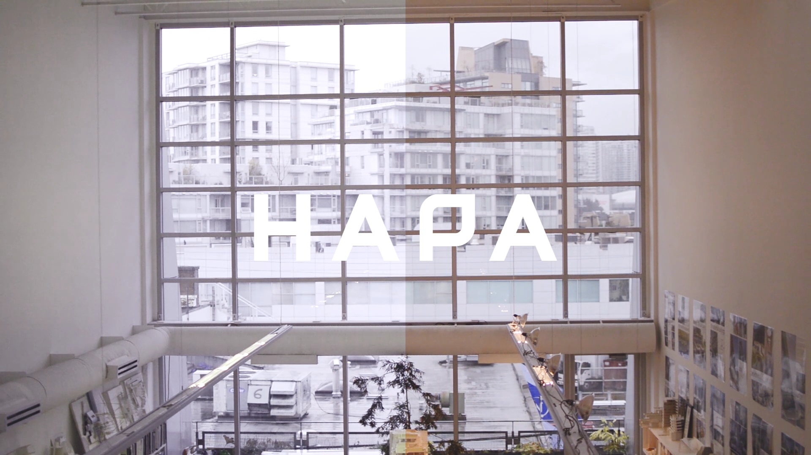
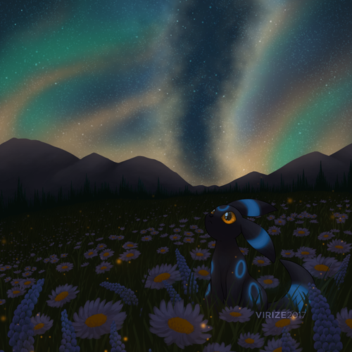
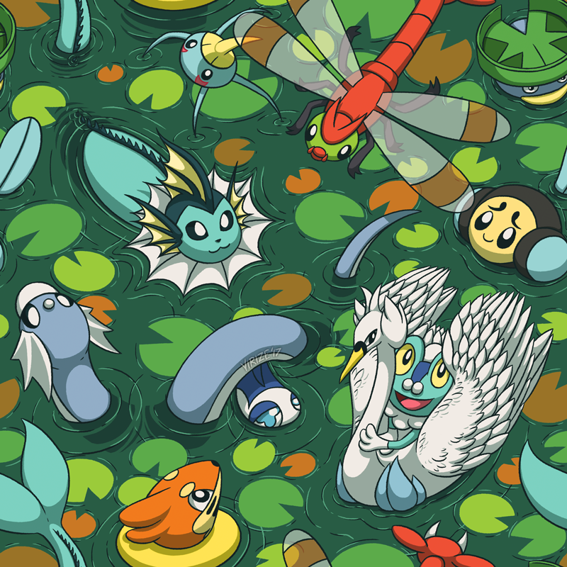
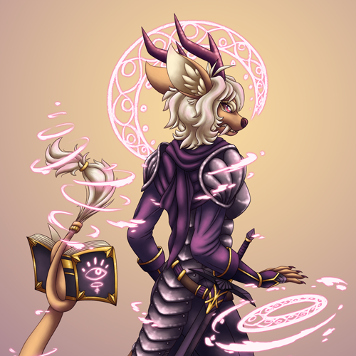

<!-- Sidebar -->
<section id="sidebar">
	

		<nav>
			<ul>
				<li><a href="#intro">About</a></li>
				<li><a href="#one">Projects</a></li>
				<li><a href="#two">Illustrations</a></li>
				<li><a href="#three">Contact</a></li>
			</ul>
		</nav>
	

</section>

<!-- Wrapper -->

<!-- Intro -->
<section id="intro" class="wrapper style1 fullscreen fade-up">
	

		<h1>Jennifer Hiew</h1>
		
A digital designer with a focus on interdisciplinary design, including user experience (UX), user interface (UI), graphic, and visual design. Jennifer is also an avid artist who enjoys engaging with anything related to technology, illustration, and the arts.

		<ul class="actions">
			<li><a href="#one" class="button scrolly">Learn more</a></li>
		</ul>
	

</section>

<!-- One -->
<section id="one" class="wrapper style2 spotlights">
	<section>
		
		

			

				<h2>Social-Eyez</h2>
				
A speculative design project that explores the possibilities and theoretical applications of augmented reality (AR) in a projected future where people continue to adapt to an ever-increasing influx of digital information, at the expense of their long-term memory.

				<ul class="actions">
					<li><a href="social-eyez.html" class="button">Learn more</a></li>
				</ul>
			

		

	</section>
	<section>
		
		

			

				<h2>Hapa Collaborative & "Why I Design"</h2>
				
 An interview documentary style film made in collaboration with the Museum of Vancouver and Simon Fraser University's School of Interactive Arts + Technology (SIAT) featuring local landscape architecture firm Hapa Collaborative.

				<ul class="actions">
					<li><a href="hapa.html" class="button">Learn more</a></li>
				</ul>
			

		

	</section>
	<section>
		
		

			

				<h2>Lululemon Web Experience Redesign</h2>
				
A project in UX/UI design focusing on redesigning Lululemon's existing product page and recreating the profile account experience to decrease online sales returns, to better educate customers about Lululemon products, and to realign Lululemon's competent in-store experience to their online presence.

				<ul class="actions">
					<li><a href="lululemon.html" class="button">Learn more</a></li>
				</ul>
			

		

	</section>
</section>

<!-- Two -->

<section id="two" class="wrapper style1 fade-up">
	

		<h2>Illustrations</h2>
		

			<article class="4u 12u$(small) work-item">
				
			</article>
			<article class="4u 12u$(small) work-item">
				
			</article>
			<article class="4u 12u$(small) work-item">
				
			</article>
			<article class="4u 12u$(small) work-item">
				
			</article>
			<article class="4u 12u$(small) work-item">
				
			</article>
			<article class="4u 12u$(small) work-item">
				
			</article>
		

		<ul class="actions">
			<li><a href="illustrations.html" class="button">View more</a></li>
		</ul>
	

</section>

<!-- Three -->
<section id="three" class="wrapper style1 fade-up">
	

		<h2>Contact</h2>
		
Want to know more or have an inquiry? Send me a message and I'll get back to you within 24 hours!

		

			<section>
				<form method="post" action="https://formspree.io/jenhiew21@gmail.com"
      method="POST">
					

						<label for="name">Name</label>
						<input type="text" name="name" id="name" placeholder="First Last"/>
					

					

						<label for="email">Email</label>
						<input type="text" name="_replyto" id="email" placeholder="youremail@example.com"/>
					

					

						<label for="message">Message</label>
						<textarea name="message" id="message" placeholder="Enter your message" rows="5"></textarea>
					

					<ul class="actions">
						<li><input type="submit" value="Submit!" class="button submit" /></li>
					</ul>
				</form>
			</section>
			<section>
				<ul class="contact">
					<li>
						<h3>Resume</h3>
						<a href="https://drive.google.com/file/d/0B1bx4u1-L6aOYkROMDU5bVhWeG8/view">View PDF</a>
					</li>
					<li>
						<h3>Social</h3>
						<ul class="icons">
							<li><a href="https://sites.google.com/view/virize-commissions/home" class="fa-paint-brush">Commissions</a></li>
							<li><a href="https://www.etsy.com/ca/shop/Virize" class="fa-shopping-bag">Etsy</a></li>
							<li><a href="https://www.facebook.com/VirizeArt" class="fa-facebook">Facebook</a></li>
							<li><a href="https://www.instagram.com/virizeze" class="fa-instagram">Instagram</a></li>
							<li><a href="https://github.com/virize" class="fa-github">GitHub</a></li>
							<li><a href="https://www.linkedin.com/in/jenniferhiew" class="fa-linkedin">LinkedIn</a></li>
							<li><a href="http://virize.tumblr.com" class="fa-tumblr">Tumblr</a></li>
							<li><a href="https://twitter.com/virizeze" class="fa-twitter">Twitter</a></li>
						</ul>
					</li>
				</ul>
			</section>
		

	

</section>
